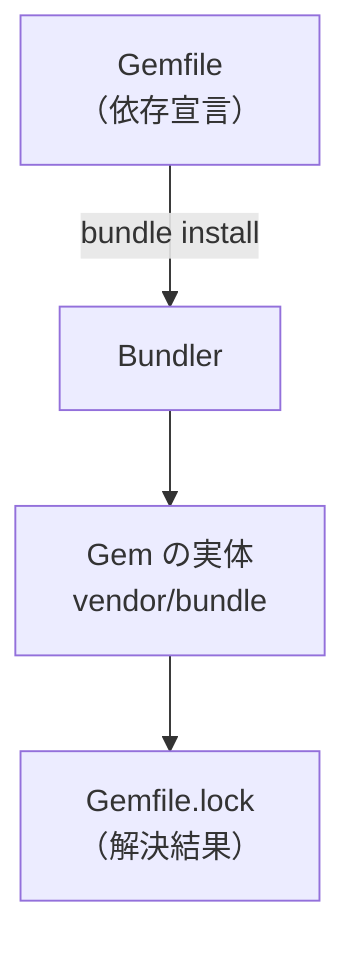

# 📦 todoapp Step 02 Gemfile & Bundler

このステップでは、必要なライブラリ (Gem) を **Gemfile** に宣言し、Bundler で一括インストールします。依存をコードで管理できるようになると、チーム開発や環境再現がスムーズになり便利です。

---

## 🎯 目的と成果物

### 目的
- Gemfile で依存ライブラリを宣言する。
- Bundler で Gem をまとめてインストールする。

### 成果物
- `Gemfile`
- `Gemfile.lock` (自動生成)
- `vendor/bundle/` 配下にインストールされた Gem 群 (自動生成)
- `.bundle/config` (Bundler の設定ファイル、自動生成)

> `vendor/bundle` を `.gitignore` に追加しておくと、巨大な Gem をリポジトリへ誤ってコミットせずに済みます。
> .gitignoreはstep10で作成しますが、任意でここで作成してもよいです。

---

## 🚀 作業フロー

### 1. Gemfile を作成してエディタで開く
```bash
touch Gemfile
cursor Gemfile  # VS Code の場合は code Gemfile
```

作成したファイルに、次の「Gemfile 例」をコピーして保存する。

#### Gemfile 例
```ruby
source "https://rubygems.org"

gem "puma"
gem "rake"
gem "rackup"
gem "sinatra"
gem "sinatra-activerecord"
gem "sqlite3"
```

---

### 2. 依存ライブラリをインストールする
```bash
bundle install --path vendor/bundle
```

- `--path` オプションで Gem をプロジェクト内 (`vendor/bundle`) に閉じ込める。
- 処理が完了したら `vendor/bundle/` に大量のフォルダが生成される。

---

## 💡 ポイント解説
| 項目 | 内容 |
|----|----|
| Gemfile | 依存を宣言するファイル。**宣言しただけ**では Gem は入らない。 |
| Gemfile.lock | 実際にインストールした Gem とバージョンを書き出すスナップショット。環境差分を防ぐ。 |
| Bundler | Gemfile を読み取り、依存グラフを解決して `bundle install` を実行するツール。 |
| `vendor/bundle` | プロジェクトローカルに Gem を置く慣習的パス。複数プロジェクト間のバージョン衝突を避けられる。 |
| `bundle exec` | Gemfile.lock に記録されたバージョンでコマンドを実行するラッパー。 |

### 依存解決イメージ


### Gemfile の見かた
| 行 | 意味 | 説明 |
|----|------|-----------|
| `source "https://rubygems.org"` | Gem を取得する公式リポジトリ | Private Gem サーバを使う場合は URL を変える |
| `gem "sinatra"` | Sinatra 本体 | HTTP ルーティングやテンプレート表示を担当する |
| `gem "sinatra-activerecord"` | Sinatra と ActiveRecord の橋渡し | DB 操作を簡単にする |
| `gem "sqlite3"` | SQLite ドライバ | ファイル型 DB を Ruby から操作する |

---

## 🛠️ ファイルを分解してみよう

### Gemfile
(※ 上記「Gemfile の見かた」参照)

### Gemfile.lock
- 実際に解決した **Gem の名前 + 正確なバージョン** を記録するファイル。
- チーム全員が同じバージョンで開発できるようロックする。
- 手動編集は原則しない。`bundle update` や `bundle install` が自動で書き換える。

### .bundle/config
- Bundler のローカル設定ファイル。
- `bundle config set --local path vendor/bundle` を実行するとここに保存される。
- プロジェクトごとに置かれるため、複数リポジトリで異なる設定を共存できる。

### vendor/bundle/
- Gem の実体を保存するフォルダ。
- Ruby や OS 別の拡張がある Gem は `ruby/3.1.0/gems/...` のようなネスト構造になる。
- **容量が大きい** し、Gemfileがあれば再現できるので Git には入れない (.gitignore) 。

---

## ✅ 動作確認
```bash
bundle exec ruby -e 'puts "Ruby 実行環境 OK"'
```
`Ruby 実行環境 OK` と表示されれば依存解決は成功している。

---

## 🚩 Commit Point
```bash
git add Gemfile Gemfile.lock
git commit -m "STEP02: add Gemfile & install dependencies"
```

> `vendor/bundle/` を追加した`.gitignore` を作成した場合は一緒にコミットする。

---

## 📝 理解チェック
- [ ] Gemfile と Gemfile.lock の役割の違いを説明できる。
- [ ] `bundle install` と `gem install` の違いを説明できる。
- [ ] `bundle exec` が必要な理由を説明できる。

---

## 🔗 もっと詳しく知りたいとき
- Bundler 公式: https://bundler.io/
- Bundler クイックスタート (5 分で体験): https://bundler.io/v2.4/#getting-started
- Sinatra 公式イントロ: https://sinatrarb.com/intro.html
- Gemfile ベストプラクティス (記事): https://thoughtbot.com/blog/gemfile-best-practices
- SQLite を採用するメリット: https://www.sqlite.org/whentouse.html

---

🤔 AI に聞いてみよう 🤖
```
Gemfile と Gemfile.lock の役割の違いを初心者向けに説明してください。

bundle install --path vendor/bundle のpathオプションは必須でしょうか？

bundle exec ruby -e 'puts "Ruby 実行環境 OK"'　はどういう意味ですか？

Gemfile.lock が衝突したときはどう解決する？

`bundle update` と `bundle install` の違いは？

``` 