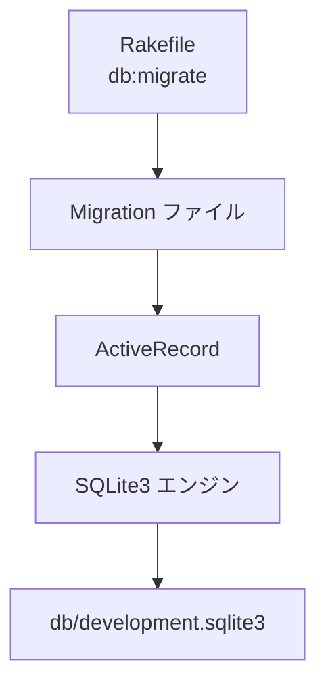

# 🗄️ todoapp Step 04 DB 設定 & マイグレーション

SQLite3 に `todos` テーブルを作成し、ActiveRecord マイグレーションの流れを体験します。コードでスキーマを管理できるようになると、履歴を辿れたり、別環境へコピーしやすくなり便利です。

---

## 🎯 目的と成果物

### 目的
- SQLite ファイルを作成し、`todos` テーブルを生成する。
- マイグレーションが **DSL → SQL → DB** の順で適用される流れを理解する。

### 成果物
- `config/database.yml`
- `Rakefile`
- `app.rb` (簡易版)
- `db/development.sqlite3` (自動生成)
- `db/schema.rb` (自動生成)
- `db/migrate/XXXXXXXXXXXXXX_create_todos.rb` (自動生成)

---

## 🚀 作業フロー

### 1. ディレクトリと設定ファイルを作成する
```bash
mkdir -p config db/migrate

touch config/database.yml
cursor config/database.yml
```
`database.yml` に下記を貼り付けて保存します。
```yaml
development:
  adapter: sqlite3
  database: db/development.sqlite3
```

### 2. Rakefile を用意する
```bash
touch Rakefile
cursor Rakefile
```
```ruby
require "sinatra/activerecord/rake"

namespace :db do
  task :load_config do
    require "./app"
  end
end
```

### 3. app.rb (簡易版) を用意する
```bash
touch app.rb
cursor app.rb
```
```ruby
require "sinatra"
require "sinatra/activerecord"
```
> 本格的なルーティングは後のステップで追加します。ここでは **DB 設定を読み込む器** として置いておきます。

### 4. マイグレーションファイルを生成する
```bash
bundle exec rake db:create_migration NAME=create_todos
```
`db/migrate/XXXXXXXXXXXXXX_create_todos.rb` が自動生成されます。ファイルを開いて下記内容に編集します。
※ XXXXXXXXXXXXXX部分にはタイムスタンプが挿入されます。

```ruby
class CreateTodos < ActiveRecord::Migration[8.0]
  def change
    create_table :todos do |t|
      t.string  :title, null: false
      t.text    :description
      t.boolean :done, default: false
      t.timestamps
    end
  end
end
```

### 5. マイグレーションを実行する
```bash
bundle exec rake db:migrate
```
- 実行ログに `CREATE TABLE` が表示され、`db/development.sqlite3` が作成されます。

---

## 💡 ポイント解説
| 項目 | 内容 |
|------|------|
| マイグレーション | スキーマ変更を Ruby DSL で記述し、バージョン管理する仕組み |
| `rake db:create_migration` | テンプレートファイルを生成する Rake タスク |
| `db/schema.rb` | 最新スキーマを Ruby で書き出したスナップショット。テスト環境のロードに使われる |
| `bundle exec rake db:migrate` | まだ適用していないマイグレーションを順番に実行する |
| `ActiveRecord::Migration[8.0]` | マイグレーション DSL のバージョンを指定するクラス |

### database.yml の最小構成
| キー | 説明 |
|------|------|
| `adapter` | 使用する DB ドライバ (`sqlite3`, `postgresql` など) |
| `database` | ファイルまたは接続先 DB の名前 |

### マイグレーション → DB 反映イメージ


> **開発環境** では SQLite を、**本番環境** では PostgreSQL を使うケースが多いです。`database.yml` に環境ごと設定を書き分けることで対応できます。

---

## 🛠️ ファイルを分解してみよう

### database.yml
| キー | 役割 | 例 |
|------|------|----|
| `adapter` | 使用する DB ドライバ | `sqlite3` / `postgresql` など |
| `database` | DB ファイルまたは接続先 | `db/development.sqlite3` |

### Rakefile
- `require "sinatra/activerecord/rake"` : ActiveRecord の Rake タスクを読み込む。
- `namespace :db do ... end` : DB 関連タスクをまとめる名前空間。
- `task :load_config` : `app.rb` を読み込んで DB 設定をメモリに載せる。

### app.rb (簡易版)
- `require "sinatra"` : Sinatra 本体を読み込む。
- `require "sinatra/activerecord"` : Sinatra と ActiveRecord を連携させ、`database.yml` を自動で読み込む。

### db/migrate/XXXX_create_todos.rb
- `class CreateTodos < ActiveRecord::Migration[8.0]` : スキーマ変更用クラスを定義する。
- `def change` : “こう変える”を宣言するメソッド。
- `create_table :todos do |t|` : `todos` テーブルを新規作成する。
  - `t.string :title, null: false` : 文字列型 `title` 列、空 NG。
  - `t.text :description` : 説明文用の列。
  - `t.boolean :done, default: false` : 完了フラグ、初期値 false。
  - `t.timestamps` : `created_at` / `updated_at` を自動で追加する。

---

## ✅ 動作確認
```bash
sqlite3 db/development.sqlite3 ".schema todos"
```
`CREATE TABLE todos (...` が出力されれば成功です。

---

## 🚩 Commit Point
```bash
git add config/database.yml Rakefile app.rb db/migrate
git commit -m "STEP04: create todos table via migration"
```

---

## 📝 理解チェック
- [ ] `rake db:migrate` が内部で何をしているか 3 行で説明できる。
- [ ] `db/schema.rb` とマイグレーションファイルの役割の違いを説明できる。

---

## 🔗 もっと詳しく知りたいとき
- ActiveRecord Migrations (公式): https://guides.rubyonrails.org/active_record_migrations.html
- SQLite の利点とユースケース: https://www.sqlite.org/whentouse.html
- テーブル設計のベストプラクティス (記事): https://zenn.dev/yuikoito/articles/db-design-basic
- Rake 入門: https://ruby.github.io/rake/

---

🤔 AI に聞いてみよう 🤖
```
マイグレーションって一言でいうと何をする仕組みですか？

マイグレーションと seed データの違いは？

`ActiveRecord::Migration[8.0]` の `[8.0]` は何を示す？

マイグレーションをロールバックするコマンドと注意点は？
```
