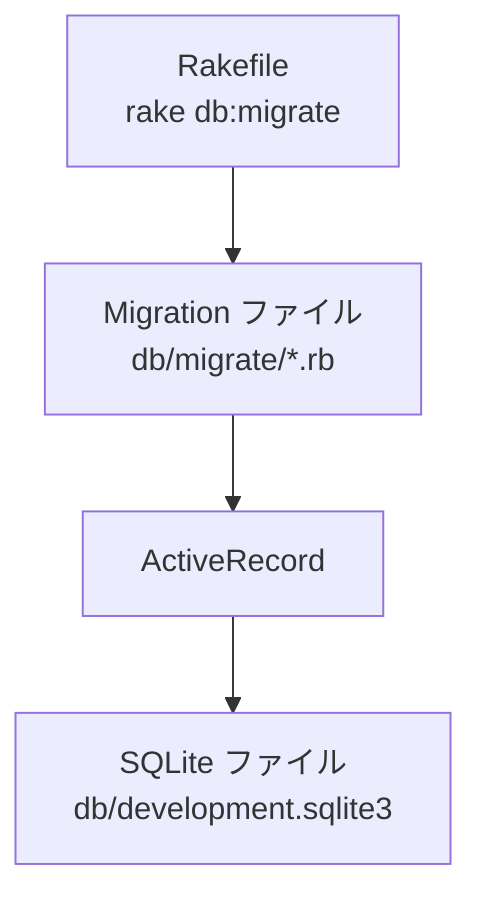

# todoapp Step 04 DB 設定 & マイグレーション

## 目的と成果物

### 目的
SQLite3 に Todo テーブルを作成し、ActiveRecord マイグレーションの流れを理解する。

### 成果物
Rakefile
app.rb
config
db/development.sqlite3 （自動生成）
db/schema.rb （自動生成）
db/migrate
db/migrate/XXXXXX_create_todos.rb （自動生成）
config/database.yml

## 作業

### DB設定に必要なディレクトリ、ファイルを作成
```bash
mkdir -p config db/migrate

touch config/database.yml
cursor  config/database.yml   # VS Code で開き、下記内容を貼り付けて保存
```

### database.yml 例
```yaml
development:
  adapter: sqlite3
  database: db/development.sqlite3
```

### Rakefile を作成 (ActiveRecord 用タスクを読み込む)
```bash
touch Rakefile
cursor  Rakefile              # VS Code で開き、下記内容を貼り付けて保存
```

### Rakefile 例
```ruby
require 'sinatra/activerecord/rake'

namespace :db do
  task :load_config do
    require "./app"
  end
end
```

### 簡易版 app.rb を作成 (DB接続設定のため)
```bash
touch app.rb
cursor app.rb                 # VS Code で開き、下記内容を貼り付けて保存
```

### app.rb 例 (簡易版)
```ruby
require "sinatra"
require "sinatra/activerecord"
```

### マイグレーション生成
```bash
bundle exec rake db:create_migration NAME=create_todos
```

このコマンドにより、db/migrate/XXXXXX_create_todos.rbが作成されます

※ XXXXXX部分は自動でタイムスタンプが挿入されます

### db/migrate/XXXXXX_create_todos.rb を下記内容に編集

```ruby
class CreateTodos < ActiveRecord::Migration[8.0]
  def change
    create_table :todos do |t|
      t.string  :title, null: false
      t.text    :description
      t.boolean :done, default: false
      t.timestamps
    end
  end
end
```

### マイグレーション実行
```bash
bundle exec rake db:migrate
```

## ポイント解説
- `rake db:create_migration` でテンプレートファイルを生成。
- DSL → SQL に変換され、SQLite ファイルに適用される。
- Rake タスクが正常動作するには app.rb での ActiveRecord 初期化が必要。
- sinatra-activerecord は自動的に config/database.yml を読み取って DB に接続する。

### 用語メモ
- **rake**: Ruby で書かれたタスク実行ツール。make の Ruby 版。
- **マイグレーション (migration)**: スキーマ変更履歴を Ruby DSL で管理する仕組み。
- **スキーマ (schema)**: テーブル定義 (列名・型・制約) の集合。
- **DSL**: Domain Specific Language。特定領域に特化した記述方式。
- **db:load_config**: Rake タスクが DB 設定を読み込むためのタスク。

### database.yml を分解してみよう
| キー | 意味 |
|------|------|
| `adapter` | どの DB を使うか指定。ここでは `sqlite3`. |
| `database` | DB ファイルの場所。`db/development.sqlite3` が作られる |

### app.rb (簡易版) を分解してみよう
- `require "sinatra"` : Sinatra 本体を読み込む。
- `require "sinatra/activerecord"` : Sinatra と ActiveRecord を連携させる拡張を読み込む。自動的に config/database.yml を読み取る。

### Rakefile を分解してみよう
- `require 'sinatra/activerecord/rake'` : ActiveRecord 用の Rake タスク群を読み込み。
- `namespace :db do ... end` : DB 関連タスクをグループ化。
- `task :load_config` : Rake タスクが app.rb を読み込んで DB 設定を取得。

### マイグレーション例を分解してみよう
- `class CreateTodos < ActiveRecord::Migration` : **テーブル変更用のクラス** を定義。
- `def change` : ここに「どう変えるか」を書くメソッドを作る。
- `create_table :todos do |t|` : `todos` というテーブルを新規作成。
  - `t.string :title, null: false` : 文字列型 `title` 列、空 NG。
  - `t.text :description` : 長い文字用の列。
  - `t.boolean :done, default: false` : true/false 列、初期値は false。
  - `t.timestamps` : `created_at` / `updated_at` を自動追加。

### データベース生成の流れ（図解）


## 動作確認
```bash
sqlite3 db/development.sqlite3 '.schema todos'
```
テーブル定義が表示されれば OK。

## Commit Point 🚩
```bash
git add db/migrate config/database.yml Rakefile app.rb
git commit -m "STEP04: create todos table via migration"
```

## 理解チェック
- [ ] マイグレーション→テーブル作成の流れを口頭で説明できる

## もっと詳しく

- ActiveRecord Migrations: https://guides.rubyonrails.org/active_record_migrations.html
- ActiveRecord マイグレーション入門: https://railsguides.jp/active_record_migrations.html
- テーブル設計の基本（カラム型と制約）

AI への質問例
```
マイグレーションって一言でいうと何をする仕組みですか？
```
